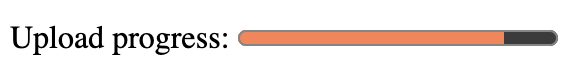
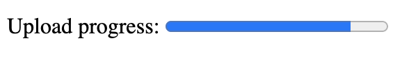

# {{title}}
## {{subtitle}}

The [progress element](https://html.spec.whatwg.org/#the-meter-element) is used to markup a value that is either progressing from one value to another, or indicating an unknown amount of progress.

The tag is rendered as a scalar bar, similar to the [meter element](./html-meter). 

For example, the following HTML

```html
<progress id="file" max="100" value="25"> 70% </progress>
```
produces the following meter in Chrome:


The element has default styles but custom styles can also be applied using CSS property accent-color.

```css
progress {
  accent-color: coral;
}
```


Finally, if the 'value' attribute is not set, the element will return a spinner bar, indicating that some unknown amount of progress is being made. 

# How to use the meter element

The element can be used to denote progress (known or unknown) along any sort of continuous range, like a file upload, a form completion, or a character level.

This is distinctly different from the `meter` element, which marks up content that falls within a range, and has an optimum value. 

# Attributes

The bar has two unique attributes, max, and value.

1. max defines the maximum value for which progress will be scaled
2. value defines the value that the progress bar should show

The bar will automatically adjust the progress meter based on these two attributes. For example, if the value is still "25" but the max is only 30, then the bar will render differently.



# Progress Element Content Categories

The progress element is considered phrasing content, defined as "the text of the document" and can be used anywhere in the document body where phrasing content is expected. That includes inside header tags, paragraph tags, and any other tag whose 'content model' contains phrasing content.

It is also "labelable" content, which is a small subcategory of HTML elements that can be associated with a label element. This list includes: <button>, <input>, <keygen> Deprecated, <meter>, <output>, <progress>, <select>, and <textarea>.


